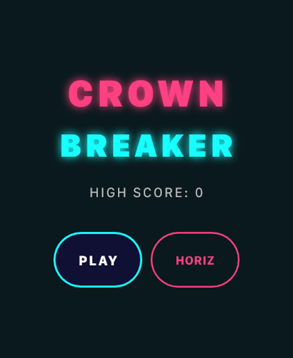
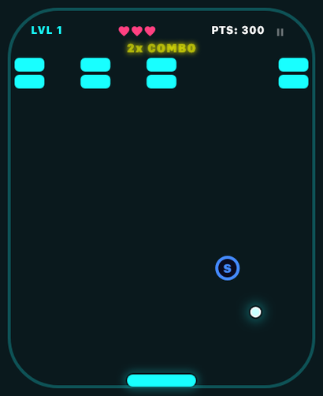
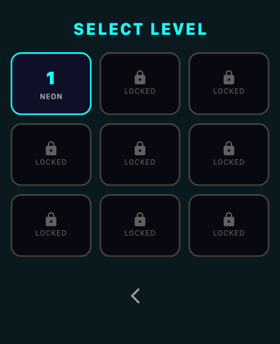

# Crown Breaker

A neon brick-breaker for Apple Watch, played entirely with the Digital Crown.
Spin the Crown to slide the paddle, smash glowing bricks across ten levels, grab
power-ups, and chase a high score — all on your wrist, no iPhone required.

<p align="center">
  
  
  
</p>

## Features

- Digital Crown paddle control with smooth, weighted movement
- Ten hand-built levels with normal, armored, indestructible, and moving bricks
- Power-ups: multiball, laser cannon, expanding paddle, sticky catch, and shield
- Horizontal and vertical play modes
- Three lives, per-level star ratings, and a persistent high score
- Haptic feedback on every bounce, break, and game over
- Bold neon rendering tuned to read clearly on a small display

## How it works

The game itself is written in Flutter and Dart. All of the gameplay — physics,
collisions, particles, scoring, and the menus — lives in [`lib/`](lib/) and runs
on a single fixed-timestep loop, drawn each frame with a `CustomPainter`.

A thin SwiftUI host in [`watchos/`](watchos/) hosts a Flutter engine and presents
its rendered frames, forwarding Digital Crown rotation and touch input back into
the Dart side over platform channels, and playing the watch's haptics on request.

### Project layout

```
lib/
  main.dart           App entry point and theme
  constants.dart      Layout constants, game states, level palette
  models.dart         Ball, Brick, PowerUp, Laser, Particle, …
  levels.dart         The ten level definitions
  game_screen.dart    Game loop, physics, and the custom painter
  widgets/            Menu, level select, HUD, and result overlays
watchos/
  Runner/             SwiftUI host that embeds and drives the engine
  HostApp/            iOS companion that ships the watch app
```

## Building

> **Note:** This repository contains the application source only. The Flutter
> watchOS engine it runs on is a separate, proprietary component and is **not**
> included here, so the project will not build as-is. The code is published for
> reference and to show how a Flutter app is structured for Apple Watch.

## Support

Questions, bugs, or feedback: **ali.ustaoglu@icloud.com**

## Privacy

Crown Breaker collects no data. Your high score is stored locally on your watch
and never leaves the device. See [PRIVACY.md](PRIVACY.md).

## License

Copyright © 2026 Mehmet Ali Ustaoğlu. All rights reserved. The source is
available for reading and personal reference only — see [LICENSE](LICENSE).
