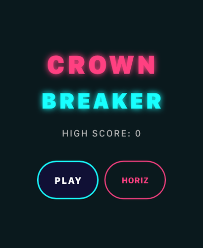
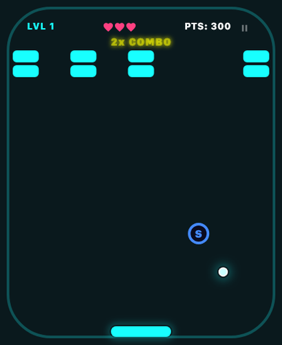
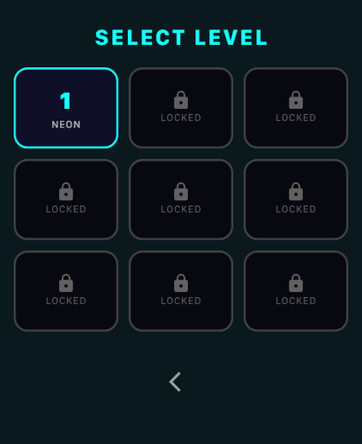

# Crown Breaker

A neon brick-breaker that runs on the smallest and the biggest Apple screen from
one Flutter codebase. Spin the Digital Crown on Apple Watch or sweep the Siri
Remote on Apple TV to slide the paddle, smash glowing bricks across 100 levels in
ten worlds, grab power-ups, and chase a high score. No iPhone involved — the
watch app is watch-only, and the TV app is its own thing.

<p align="center">
  
  
  
</p>

## Features

- Digital Crown paddle control with smooth, weighted movement
- Siri Remote control on Apple TV: touchpad, D-pad, and focus-safe menus
- 100 generated levels across ten worlds — normal, armored, indestructible,
  ghost, and moving bricks
- Power-ups: multiball, laser cannon, expanding paddle, sticky catch, and shield
- Horizontal and vertical play modes
- Three lives, per-level star ratings, and a persistent high score
- Haptic feedback on every bounce, break, and game over (watch only — the Siri
  Remote has no Taptic Engine)
- Bold neon rendering that reads on a 40mm wrist and scales up to 1080p

## How it works

The game itself is written in Flutter and Dart. All of the gameplay — physics,
collisions, particles, scoring, and the menus — lives in [`lib/`](lib/) and runs
on a single fixed-timestep loop, drawn each frame with a `CustomPainter`.

A thin SwiftUI host in [`watchos/`](watchos/) hosts a Flutter engine and presents
its rendered frames, forwarding Digital Crown rotation and touch input back into
the Dart side, and playing the watch's haptics on request. [`tvos/`](tvos/) is a
UIKit host that does the same for the Siri Remote.

The two screens differ by about 30× in area, so the TV simulates in a fixed
logical viewport (`kTvLogicalHeight`) and scales up — the watch-tuned paddle,
ball, and type sizes keep their proportions instead of rendering microscopic.

Save data (high score, unlocked levels, star ratings) goes through a single
`SharedPreferences` call on both platforms. Each screen resolves it to its own
federated implementation — [`shared_preferences_watchos`][spw] and
[`shared_preferences_tvos`][spt], both FFI over `NSUserDefaults`. That backing
store matters on Apple TV in particular, where the Documents directory can be
purged at any time.

[spw]: https://pub.dev/packages/shared_preferences_watchos
[spt]: https://pub.dev/packages/shared_preferences_tvos

### Project layout

```
lib/
  main.dart           App entry point and theme
  constants.dart      Layout constants, game states, level palette
  models.dart         Ball, Brick, PowerUp, Laser, Particle, …
  levels.dart         Level definitions
  level_gen.dart      Deterministic generator for the ten worlds
  game_screen.dart    Game loop, physics, and the custom painter
  widgets/            Menu, level select, HUD, and result overlays
watchos/
  Runner/             SwiftUI host that embeds and drives the engine
  HostApp/            Thin container the watch-only app ships inside
tvos/
  Runner/             UIKit host, Siri Remote input, focus handling
```

## Building

> **Note:** This repository contains the application source only. The Flutter
> watchOS and tvOS engines it runs on are separate, proprietary components and
> are **not** included here, so the project will not build as-is. The code is
> published for reference and to show how one Flutter app is structured for both
> Apple Watch and Apple TV.

```bash
flutter-watchos build watchos --release
```

```bash
flutter-tvos build tvos --release
```

## Support

Questions, bugs, or feedback: **ali.ustaoglu@icloud.com**

## Privacy

Crown Breaker collects no data. Your high score is stored locally on the device
you played on and never leaves it. See [PRIVACY.md](PRIVACY.md).

## License

Copyright © 2026 Mehmet Ali Ustaoğlu. All rights reserved. The source is
available for reading and personal reference only — see [LICENSE](LICENSE).
